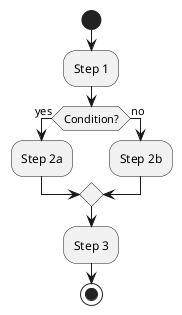

# PlantUML to Draw.io Converter

A tool for converting PlantUML diagrams to Draw.io format.

*[Deutsche Version weiter unten](#deutsche-version)*

<p align="center">
  
</p>

## 📋 Overview

This project enables the conversion of PlantUML diagrams to Draw.io format, allowing for seamless integration of UML diagrams into various documentation and presentation workflows. The web interface now uses a PlantUML-to-SVG-to-Draw.io pipeline compatible with the approach from `rglaue/plantuml_to_drawio`, which means it can handle any diagram type that PlantUML itself can render.

## ✨ Key Features

- 🔄 Conversion of PlantUML diagrams to Draw.io XML by embedding rendered SVG
- 🧬 Preserves the original PlantUML source inside the Draw.io document
- 📚 Supports class, sequence, activity, and other PlantUML-renderable diagrams
- 🖥️ User-friendly GUI and command-line interface
- 📦 Single-file and batch file conversion in the web interface

## 🚀 Quick Start

### Installation

```bash
# Clone repository
git clone https://github.com/doubleSlashde/plantuml2drawio.git
cd plantuml2drawio

# Recommended: Use Python 3.11 for best compatibility
# Create and activate a virtual environment (optional but recommended)
python3.11 -m venv venv
source venv/bin/activate  # On Windows: venv\Scripts\activate

# Install dependencies
pip install -r requirements.txt

# Or install in development mode
pip install -e .
```

### Usage

#### Command Line

```bash
# Using the entry point scripts
./p2d-cli --input examples/activity_examples/simple_activity.puml --output output.drawio

# Or using Python modules
python -m src.plantuml2drawio.core --input examples/activity_examples/simple_activity.puml --output output.drawio
```

#### Graphical User Interface

```bash
# Using the entry point scripts
./p2d-gui

# Or using Python modules
python -m src.plantuml2drawio.app
```

#### Web Interface

The repository now includes a browser-based interface for converting PlantUML
diagrams into Draw.io-importable XML.

Start the web app locally:

```bash
# Windows (PowerShell)
py -3.9 -m venv venv
.\venv\Scripts\activate
pip install -r requirements.txt
pip install -r requirements-web.txt
pip install -e .
python web_app.py
```

Requirements:
- Java must be installed and available on `PATH`
- The app auto-downloads `plantuml-1.2024.4.jar` into `tools/` on first use
- You can override the jar location with `PLANTUML_JAR_PATH`

Then open:

```text
http://127.0.0.1:5000
```

How to use:
- Paste PlantUML content into the left editor
- Choose output format (`Draw.io XML` or `JSON`)
- Click `Convert` (or press `Ctrl+Enter`)
- Copy the result or download it as `.drawio`
- In Draw.io: `File -> Import From -> Device` and select the downloaded file

Batch upload:
- Click `Choose .puml files` and select multiple `.puml`, `.plantuml`, or `.txt` files
- Click `Batch Convert`
- The app downloads `converted-diagrams.zip`
- The ZIP contains one converted output per source file plus `conversion-report.json`

Notes:
- Draw.io output is generated by embedding the PlantUML-rendered SVG, not by rebuilding native Draw.io shapes element-by-element
- JSON output is a wrapper around the generated Draw.io XML for inspection/debugging
- Conversion requires Java and the PlantUML jar at runtime

### Deploy Web Interface

For production-style deployment, run Flask behind Waitress:

```bash
# Windows (PowerShell)
.\venv\Scripts\activate
pip install -r requirements-web.txt
waitress-serve --host 0.0.0.0 --port 8080 web_app:app
```

You can then access the app from:

```text
http://localhost:8080
```

Environment recommendations:

- Place the service behind a reverse proxy (Nginx/Caddy/IIS) for TLS/HTTPS
- Restrict request size and add rate limiting at the proxy layer
- Keep `debug=False` for non-development environments
- Ensure Java is available in the deployment environment or set `JAVA_BIN`
- Set `PLANTUML_JAR_PATH` if you want to provide the PlantUML jar yourself instead of auto-downloading it

#### Deploy To Render

This repository includes a Docker-based Render deployment because conversion now requires both Python and Java at runtime.

Files used:

- `Dockerfile`
- `render.yaml`

Steps:

1. Push the repository to GitHub
2. In Render, create a new `Blueprint` deployment from the repository
3. Render will detect `render.yaml` and build the service with Docker
4. Open the generated public URL after deploy completes

The container:

- Installs Python dependencies
- Installs a headless Java runtime
- Starts the app with Waitress on Render's assigned port

Notes:

- The PlantUML jar is downloaded automatically on first conversion request unless `PLANTUML_JAR_PATH` is set
- If you want to bundle the jar into the image later, add it under `tools/` and copy it in the `Dockerfile`

## 📦 Project Structure

The project has been reorganized for better maintainability and extensibility:

```
plantuml2drawio/
├── README.md                    # This file
├── LICENSE                      # License information
├── requirements.txt             # Python dependencies
├── setup.py                     # Setup script for installation
├── p2d-cli                      # Command-line entry point
├── p2d-gui                      # GUI entry point
├── src/                         # Main source code
│   ├── plantuml2drawio/         # Core package
│   │   ├── core.py              # Core functionality
│   │   ├── app.py               # GUI application
│   │   ├── config.py            # Configuration settings
│   │   └── drawio_embed_converter.py # SVG embed converter for Draw.io XML
├── web_app.py                   # Flask web server
├── templates/                   # HTML templates for web UI
├── static/                      # CSS and JavaScript for web UI
├── tests/                       # Tests
├── docs/                        # Documentation
├── examples/                    # Example diagrams
└── resources/                   # Resources like icons
```

## 📚 Documentation

Detailed documentation is available in the `docs` directory:

- [Installation and Usage](docs/Installation_und_Benutzung.md)
- [Workflow](docs/Arbeitsablauf.md)
- [System Architecture](docs/Systemarchitektur.md)
- [Extension Possibilities](docs/Erweiterungen.md)

## 🧪 Examples

The project contains examples in the `examples` directory:

### Activity Diagram

**PlantUML Input**:


**Draw.io Output**:

<p align="center">
  
</p>

## 🛠️ Technology Stack

- Python 3.11 (recommended) or 3.6+
- Java runtime for PlantUML SVG rendering
- PlantUML jar for diagram rendering
- customtkinter for GUI
- XML libraries for Draw.io generation

## 📦 Executables

The project provides pre-built executables for both Windows and macOS through GitHub Actions. These executables are automatically built when:
- A new version tag is pushed (e.g., `v1.0.0`)
- The workflow is manually triggered via GitHub Actions UI

### Download Executables

1. Go to the [Releases](https://github.com/doubleSlashde/plantuml2drawio/releases) page to download the latest release
2. Or download the latest build artifacts from the [Actions](https://github.com/doubleSlashde/plantuml2drawio/actions) page:
   - `p2d-windows` - Windows executable with all dependencies
   - `p2d-macos` - macOS application bundle (.app)

### Building Executables Locally

You can build the executables locally using PyInstaller. You only need the runtime dependencies and PyInstaller:

```bash
# Install build requirements (includes runtime dependencies)
pip install -r requirements-build.txt

# Build executable (recommended with Python 3.11)
python -m PyInstaller --clean p2d.spec
```

The built executables will be available in the `dist` directory:
- Windows: `dist/p2d/p2d.exe` (with dependencies)
- macOS: `dist/p2d.app` (application bundle)

Note: The final executable will include all necessary runtime dependencies, so end users don't need to install Python or any requirements.

## 🗺️ Roadmap

- [x] Support for activity diagrams
- [ ] Support for usecase diagrams
- [ ] Support for sequence diagrams
- [ ] Support for class diagrams
- [ ] Support for component diagrams
- [ ] Advanced layout management
- [ ] Integration with PlantUML server
- [x] Web interface

## 🤝 Contributing

Contributions are welcome! Check out the [Extension Possibilities](docs/Erweiterungen.md) to learn more about possible contributions.

## 📄 License

This project is licensed under the MIT License - see the [LICENSE](LICENSE) file for details.

## 🙏 Acknowledgements

- [PlantUML](https://plantuml.com/) for the excellent UML diagram syntax
- [Draw.io](https://www.draw.io/) for the open XML format and diagram editing functionality

---

<p align="center">
  Created with ❤️ for UML enthusiasts and software developers
</p>

---

<a name="deutsche-version"></a>
# Deutsche Version

## 📋 Übersicht

Dieses Projekt ermöglicht die Konvertierung von PlantUML-Diagrammen in das Draw.io-Format, wodurch eine nahtlose Integration von UML-Diagrammen in verschiedene Dokumentations- und Präsentationsworkflows ermöglicht wird. Der Konverter unterstützt derzeit Aktivitätsdiagramme und wird kontinuierlich um weitere Diagrammtypen erweitert.

## ✨ Hauptmerkmale

- 🔄 Konvertierung von PlantUML-Aktivitätsdiagrammen in das Draw.io-Format
- 🔍 Automatische Erkennung des PlantUML-Diagrammtyps
- 🖥️ Benutzerfreundliche GUI sowie Kommandozeilenschnittstelle
- 📐 Automatische Layout-Berechnung für optimale Diagrammdarstellung
- 🧩 Modularer Aufbau für einfache Erweiterbarkeit

## 🚀 Schnellstart

### Installation

```bash
# Repository klonen
git clone https://github.com/doubleSlashde/plantuml2drawio.git
cd plantuml2drawio

# Empfohlen: Python 3.11 für beste Kompatibilität verwenden
# Virtuelle Umgebung erstellen und aktivieren (optional, aber empfohlen)
python3.11 -m venv venv
source venv/bin/activate  # Unter Windows: venv\Scripts\activate

# Abhängigkeiten installieren
pip install -r requirements.txt

# Oder im Entwicklungsmodus installieren
pip install -e .
```

### Verwendung

#### Kommandozeile

```bash
# Über die Einstiegsskripte
./p2d-cli --input examples/activity_examples/simple_activity.puml --output output.drawio

# Oder über Python-Module
python -m src.plantuml2drawio.core --input examples/activity_examples/simple_activity.puml --output output.drawio
```

#### Grafische Benutzeroberfläche

```bash
# Über die Einstiegsskripte
./p2d-gui

# Oder über Python-Module
python -m src.plantuml2drawio.app
```
