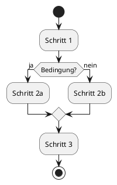

# PlantUML to Draw.io Konverter - Dokumentation

Diese Dokumentation beschreibt die Struktur, Funktionsweise und Verwendung des PlantUML to Draw.io Konverters.

## Projektorganisation

Das Projekt ist wie folgt strukturiert:

```
plantuml2drawio/
├── README.md                    # Hauptdokumentation
├── LICENSE                      # Lizenzinformationen
├── requirements.txt             # Python-Abhängigkeiten
├── setup.py                     # Setupskript für die Installation
├── .gitignore                   # Git-Ignore-Datei
├── plantuml2drawio-cli          # Kommandozeileneinstiegspunkt
├── plantuml2drawio-gui          # GUI-Einstiegspunkt
├── src/                         # Hauptquellcode
│   ├── plantuml2drawio/         # Kernpaket
│   │   ├── core.py              # Kernfunktionalität
│   │   ├── app.py               # GUI-Anwendung
│   │   └── config.py            # Konfigurationseinstellungen
│   └── processors/              # Diagramm-Prozessoren
│       ├── base_processor.py    # Basisklasse für Prozessoren
│       └── activity_processor.py # Aktivitätsdiagramm-Prozessor
├── tests/                       # Tests
│   ├── test_diagram_type.py     # Tests für Diagrammtyperkennung
│   └── data/                    # Testdaten
├── docs/                        # Dokumentation
│   ├── Installation_und_Benutzung.md
│   ├── Arbeitsablauf.md
│   └── ... (weitere Dokumentation)
├── examples/                    # Beispieldiagramme
│   └── activity_examples/       # Aktivitätsdiagramm-Beispiele
└── resources/                   # Ressourcen
    └── icons/                   # Anwendungsicons
```

## Schnelleinstieg

### Installation

```bash
# Repository klonen
git clone https://github.com/[username]/plantuml2drawio.git
cd plantuml2drawio

# Entwicklungsmodus installieren
pip install -e .
```

### Verwendung

#### Kommandozeile

```bash
# Direkt über die Einstiegsskripte
./p2d-cli --input path/to/diagram.puml --output path/to/diagram.drawio

# Oder über die installierten Kommandozeilenbefehle
p2d-cli --input path/to/diagram.puml --output path/to/diagram.drawio
```

#### Grafische Benutzeroberfläche

```bash
# Direkt über die Einstiegsskripte
./p2d-gui

# Oder über die installierten Kommandozeilenbefehle
p2d-gui
```

## Weitere Dokumentation

- [Installation und Benutzung](Installation_und_Benutzung.md)
- [Arbeitsablauf](Arbeitsablauf.md)
- [Systemarchitektur](Systemarchitektur.md)
- [Erweiterungen](Erweiterungen.md)
- [Module](Module.md)
- [Komponenten](Komponenten.md)
- [Systemübersicht](Systemuebersicht.md)

## Entwicklung

Für Entwickler, die zum Projekt beitragen möchten, bietet die neue modulare Struktur folgende Vorteile:

1. **Neue Diagrammtypen hinzufügen**: Erstellen Sie einfach einen neuen Prozessor im `src/processors/`-Verzeichnis, der von `BaseDiagramProcessor` erbt.

2. **Tests**: Erweitern Sie die Tests im `tests/`-Verzeichnis.

3. **Beispiele**: Fügen Sie Beispiele in das `examples/`-Verzeichnis ein, um die Funktionsweise zu demonstrieren.

Die Projektstruktur folgt gängigen Python-Standards und ermöglicht eine einfache Erweiterung und Wartung.

# PlantUML to Draw.io Converter

Ein Werkzeug zur Konvertierung von PlantUML-Diagrammen in das Draw.io-Format.

<p align="center">
  
</p>

## 📋 Übersicht

Dieses Projekt ermöglicht die Konvertierung von PlantUML-Diagrammen in das Draw.io-Format, wodurch eine nahtlose Integration von UML-Diagrammen in verschiedene Dokumentations- und Präsentationsworkflows ermöglicht wird. Der Konverter unterstützt derzeit Aktivitätsdiagramme und wird kontinuierlich um weitere Diagrammtypen erweitert.

## ✨ Hauptmerkmale

- 🔄 Konvertierung von PlantUML-Aktivitätsdiagrammen in das Draw.io-Format
- 🔍 Automatische Erkennung des PlantUML-Diagrammtyps
- 🖥️ Benutzerfreundliche GUI sowie Kommandozeilenschnittstelle
- 📐 Automatische Layout-Berechnung für optimale Diagrammdarstellung
- 🧩 Modularer Aufbau für einfache Erweiterbarkeit

## 🚀 Schnellstart

### Installation

```bash
# Repository klonen
git clone https://github.com/[username]/plantuml2drawio.git
cd plantuml2drawio

# Abhängigkeiten installieren
pip install -r requirements.txt
```

### Verwendung

#### Kommandozeile

```bash
python p2d-cli --input diagrams/activity.puml --output diagrams/activity.drawio
```

#### Grafische Benutzeroberfläche

```bash
./p2d-gui
```

## 📚 Dokumentation

Detaillierte Dokumentation ist im `docs`-Verzeichnis verfügbar:

- [Installation und Benutzung](Installation_und_Benutzung.md)
- [Arbeitsablauf](Arbeitsablauf.md)
- [Systemarchitektur](Systemarchitektur.md)
- [Erweiterungsmöglichkeiten](Erweiterungen.md)

## 🧪 Beispiele

### Aktivitätsdiagramm

**PlantUML-Eingabe**:


**Draw.io-Ausgabe**:

<p align="center">
  
</p>

## 🛠️ Technologiestack

- Python 3.6+
- tkinter für die GUI
- Reguläre Ausdrücke für das Parsing
- XML-Bibliotheken für die Draw.io-Generierung

## 🗺️ Roadmap

- [x] Unterstützung für Aktivitätsdiagramme
- [ ] Unterstützung für Sequenzdiagramme
- [ ] Unterstützung für Klassendiagramme
- [ ] Unterstützung für Komponentendiagramme
- [ ] Erweitertes Layout-Management
- [ ] Integration mit PlantUML-Server
- [ ] Web-Interface

## 🤝 Mitwirken

Beiträge sind willkommen! Bitte lesen Sie unsere [Beitragsrichtlinien](CONTRIBUTING.md) für weitere Informationen.

## 📄 Lizenz

Dieses Projekt ist unter der MIT-Lizenz lizenziert - siehe die [LICENSE](LICENSE) Datei für Details.

## 🙏 Danksagungen

- [PlantUML](https://plantuml.com/) für die hervorragende UML-Diagramm-Syntax
- [Draw.io](https://www.draw.io/) für das offene XML-Format und die Diagramm-Bearbeitungsfunktionen

---

<p align="center">
  Erstellt mit ❤️ für UML-Enthusiasten und Softwareentwickler
</p>
